# **Campfire Cooking Website Testing** 

The testing, which follows, has been completed on the initial version of the Campfire Cooking Website.

All testing was conducted on the site deployed from Heroku (https://andrewboyd79-campfire-cooking.herokuapp.com/recipes)

---

## **Contents**
1. **[Functional Testing](#Functional-testing)**
    - [Register](#Register)
    - [Logout](#Logout)
    - [Login](#Login)
    - [My Recipes](#My-recipes)
    - [Recipes](#Recipes)
    - [Add Recipes](#Add-recipes)
    - [Edit Recipes](#Edit-recipes)
    - [Delete Recipes](#Delete-recipes)
    - [Search](#Search)
 
2. **[User Story testing](#User-story-testing)**

3. **[Responsiveness Testing](#Responsiveness-testing)**
    - [Mobile](#Mobile)
    - [Tablet](#Tablet)

4. **[Browser Testing](#Browser-testing)**

5. **[Bugs](#Bugs)**

6. **[Validation](#Validation)**

---

# **Functional Testing**
The functionality of each webpage/process was tested from the Heroku deployed site - any issues were noted: 

## Register

The registration process was tested to ensure that all fields on the form were completed fully and the password confirmation checks work as expected:

User cannot register with no information supplied - as expected

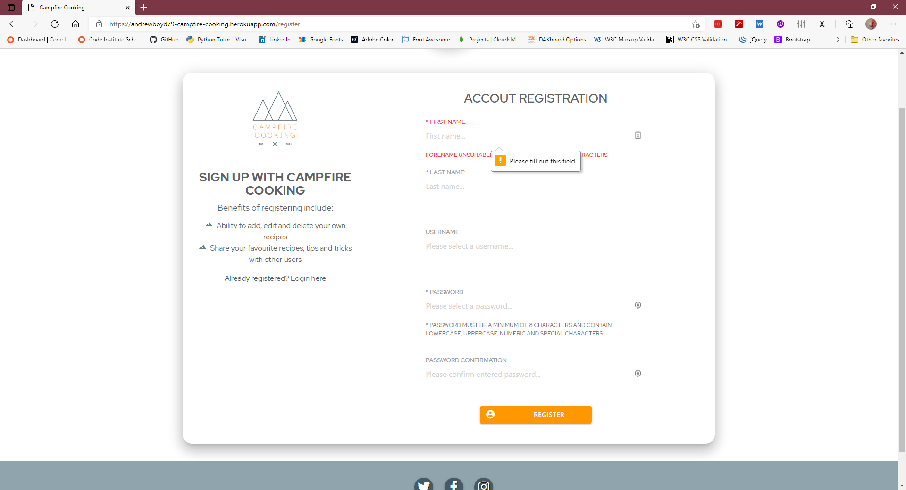

User cannot register having submitted only a forename

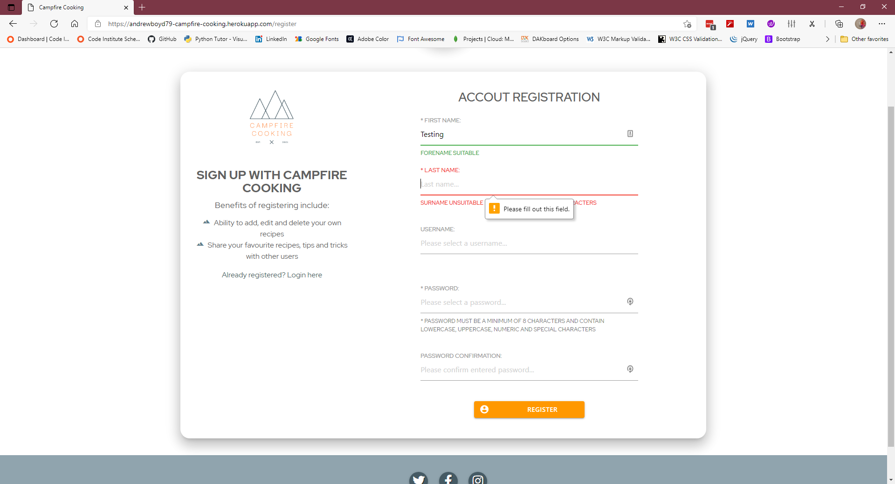

User cannot register having only submitted forename/surname

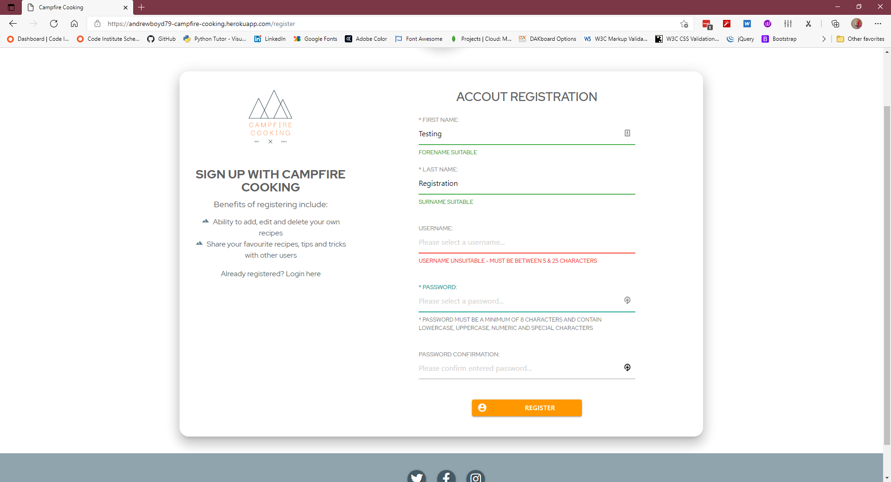

User cannot register without submitting a confirmed password

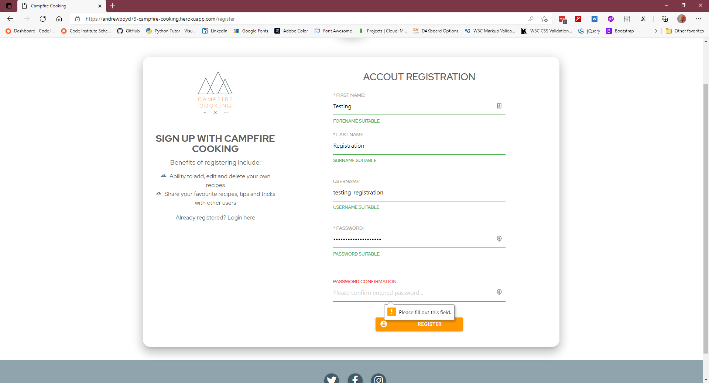

User cannot register when the passwords do not match

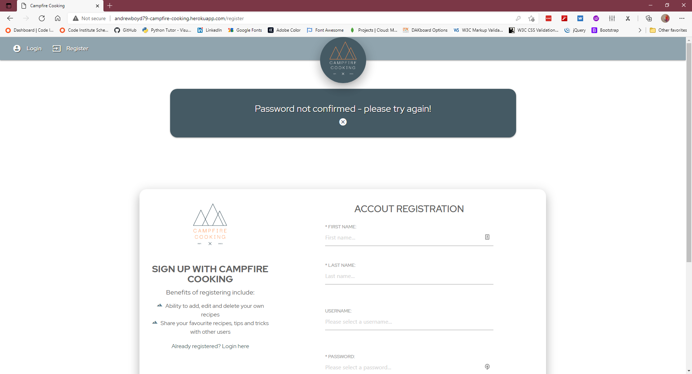

User can register when all information has been correclty submitted

---

## Logout

User can successfully logout from the site

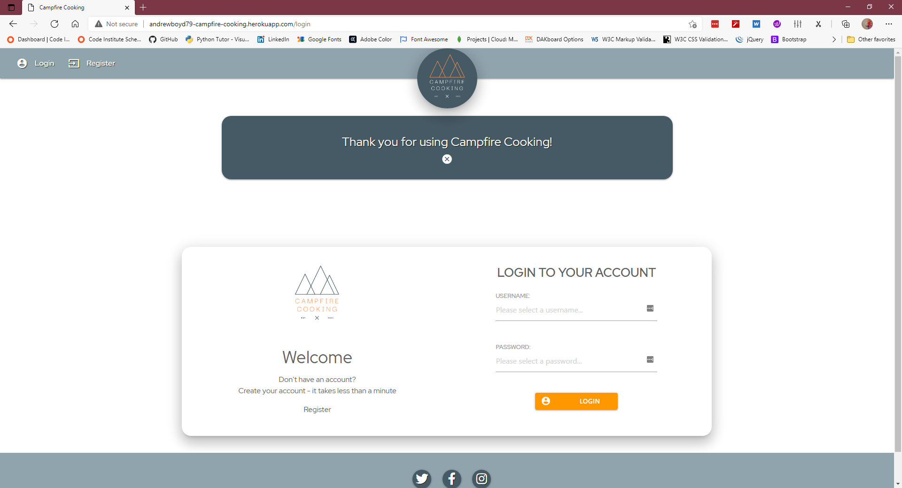

---

## Login

User cannot login without supplying any information

User cannot login with only a username

User cannot login with only a password supplied

User cannot login if password is supplied in incorrect format

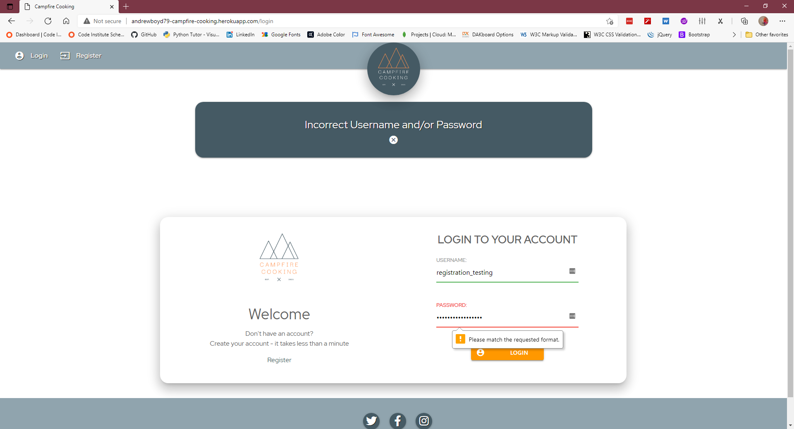

User cannot login with incorrect password

User can login successfully when all required information is correctly provided

---

## My Recipes

User profile when they have entered no recipes

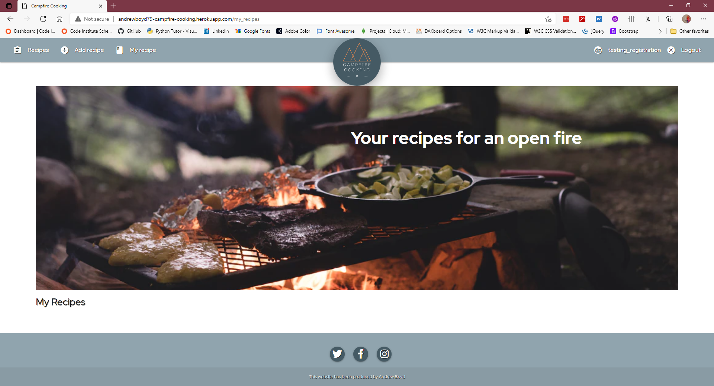

User profile when user has added recipes

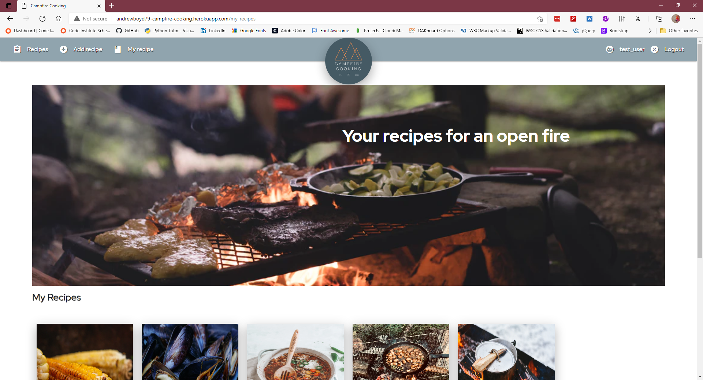

---

## Recipes

User cannot edit recipes as they are not the session user of any of the added recipes

Users can only edit their recipes

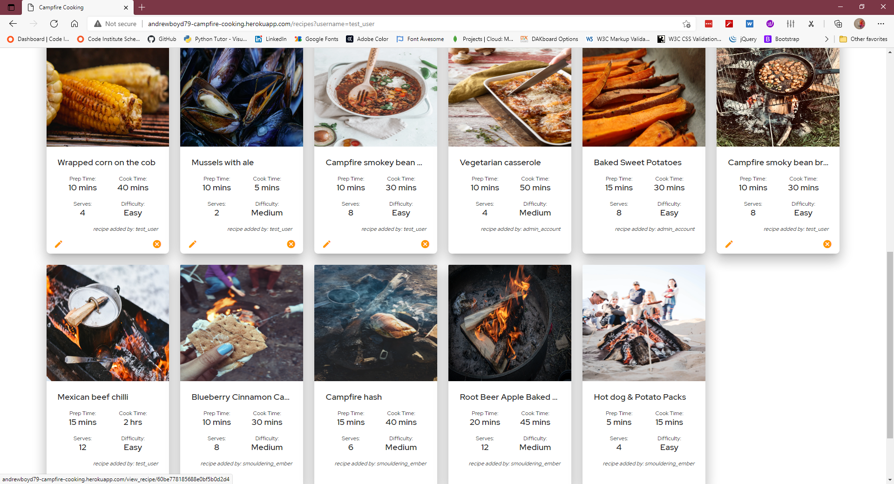

Admin users can eit all recipes

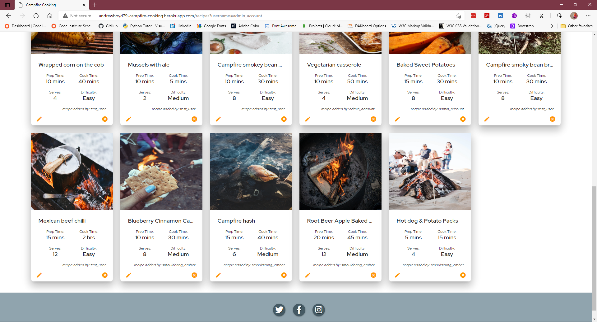

---

## Edit Recipes

Users can edit recipes they have access to

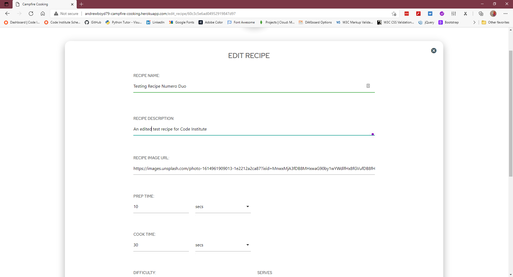

Users successfully updating recipe

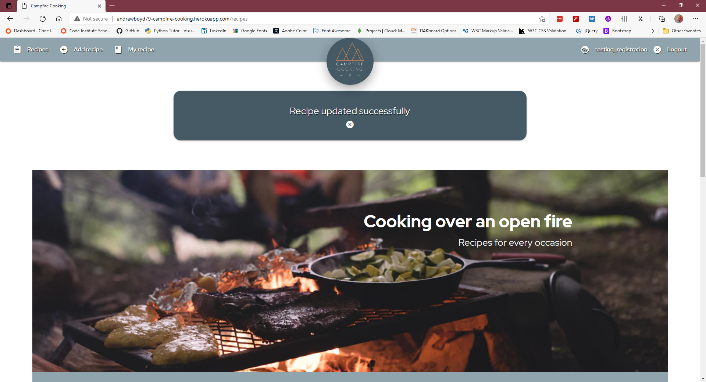

Edited recipe with changes

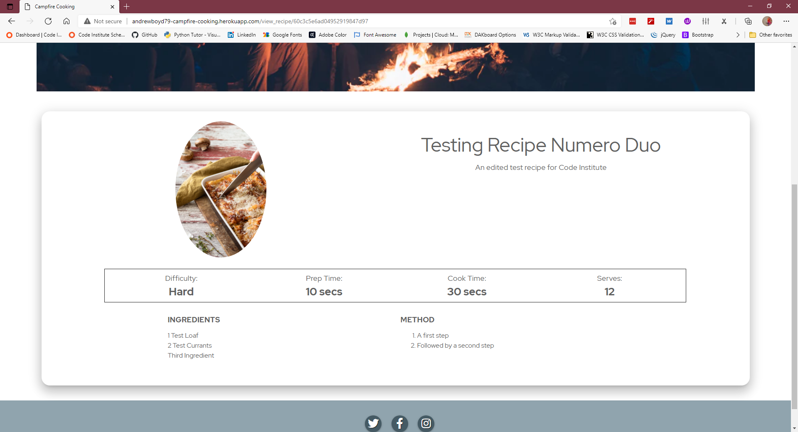

---

## Delete Recipes

User with ability to delete recipe

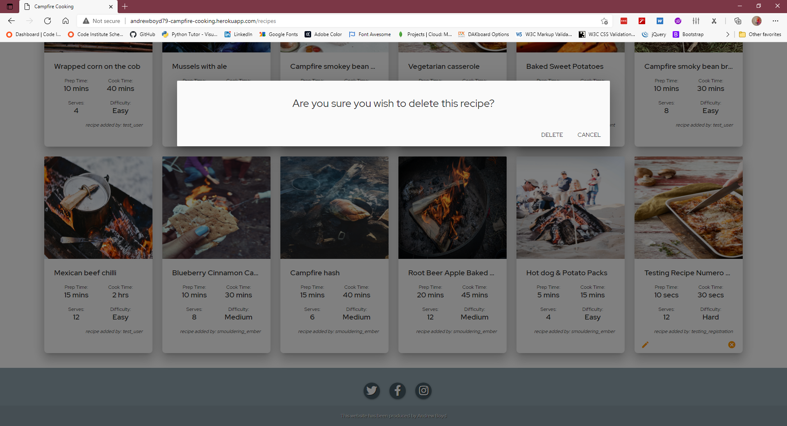

User cancels deletion - recipe remains

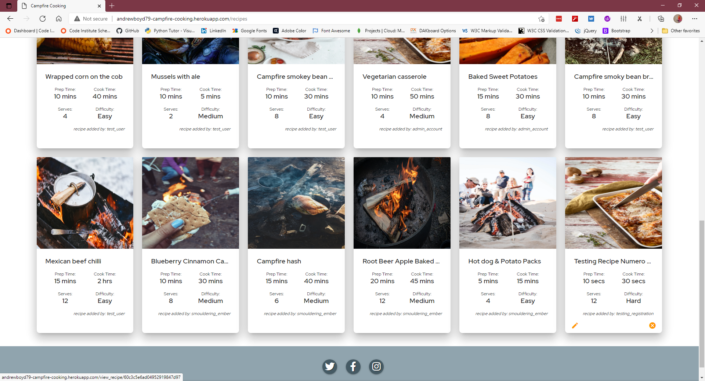

User successfully deletes recipes

Recipes page shows recipe no longer available

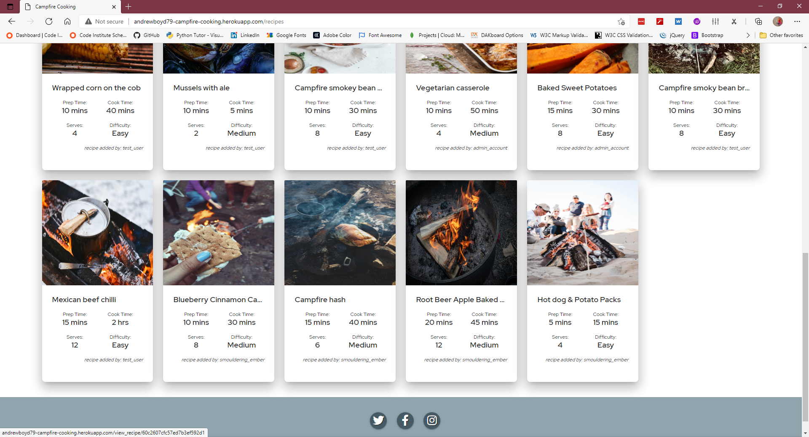

---

## Search

User enters a search term

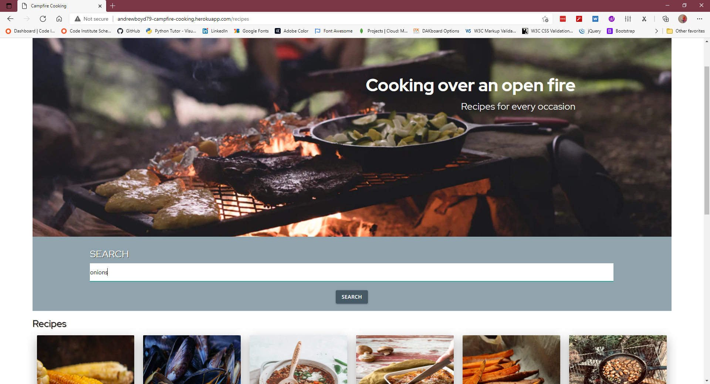

Recipes are successfully returned to user

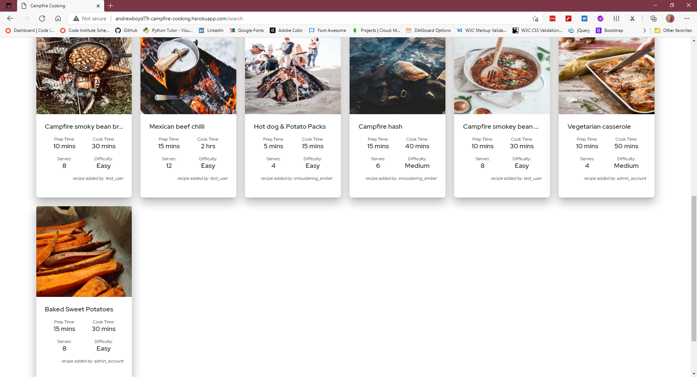

---

# **User story testing**

The user stories from the README.md file were used as a basis for testing.  For each test case the test acceptance criteria, evidence/observations and outcome have been recorded:

**1. "As a user I want to find campfire recipes so that I can cook meals on an open fire"**

Acceptance criteria:
- End users should be able to find campfire recipes  
- This information should be available on all device sizes.

Evidence/Observations:
- The recipes.html page contains recipes suitable for cooking on an open fire 

Outcome: Test successful

---

**2. "2. As a user I want to be able to add my own recipes so that others can enjoy them"**

Acceptance criteria:
- End users should be able to upload a recipe 
- This information should be available on all device sizes.

Evidence/Observations:
- Users can upload recipes through the add recipes function

Outcome: Test successful

---

**3. "As a user I want to be able to edit my recipes so that I can update/amend details after I've submitted them"**

Acceptance criteria:
- End users should be able to edit their recipes after submission 
- This information should be available on all device sizes.

Evidence/Observations:
- Users can edit their recipes through the edit recipes function

Outcome: Test successful

---

**4. "4. As a user I want to be able to delete my recipes so that I'm in control of my recipe"**

Acceptance criteria:
- End users should be able to deleted their recipes 
- This alternative means should be available on all device sizes.

Evidence/Observations:
- Users can delete their recipes from the recipes page

Outcome: Test successful

---

**5. "5. As a user I want to find out best practices for campfire cooking so that I can improve my cookery"**

Acceptance criteria:
- The website, should give users information on how they should cook the recipes 
- This information should be available on all device sizes.

Evidence/Observations:
- The website gives method steps for each recipe

Outcome: Test successful

---

**6. "6. As a user I want to be able to search for recipes so I can quickly find the information I'm looking for"**

Acceptance criteria:
- The website has search functionality
- This information should be available on all device sizes.

Evidence/Observations:
- The website gives method steps for each recipe

Outcome: Test successful

---

**7. "7. As a business owner I want to be able to generate increased brand awareness so that my brand becomes synonymous with open fire cooking"**

Acceptance criteria:
- The branding of the company should be clear throughout the website
- This information should be available on all device sizes.

Evidence/Observations:
- The website has the Campfire cooking branding, colours and logo throughout

Outcome: Test successful

---

**8. "8. As a site administrator I want to be able to maintain the user recipe section so I can maintain the quality of the recipes submitted"**

Acceptance criteria:
- The administratorshould be able to edit and remove recipes if required
- This information should be available on all device sizes.

Evidence/Observations:
- When using the administrator account all recipes can be edited and/or deleted

Outcome: Test successful

---

# **Responsiveness Testing**

The website has been designed to be responsive to different screen sizes. The following has been checked on both mobile (iPhone SE/safari) and tablet (ipad/safari browser) sized devices.

## Mobile

- The cards on the recipes pages display singly as expected
- Image elements on view recipe disappear as expected
- Sidenav is deployed

## Tablet 

- The cards on the recipes pages display in two or three as expected (depends on size of tablet)
- Sidenav may be deployed (depends on size/orientation of tablet)

---

# **Browser testing**
The website has been tested on the following browsers:
- Firefox browser (Version 86.0 (64-bit))
- Microsoft Edge browser (Version 89.0.774.54 (Official build) (64-bit))
- Chrome Browser (Version 89.0.4389.90 (Official Build) (64-bit))
- Safari Browser

---

# **Bugs**
The following bugs were noted during development of the Campfire Cooking website:
- Delete functionality worked correctly prior to using a modal to confirm the deletion. Once the modal was coded recipes were deleted but it was not the selected recipe but the first recipe from that user. Solution: as the generation of the modal was part of the for loop the modal needed to be created with a unique id to allow deletion of correct recipe.
- Social media icons were not available on Materialize. Solution: found some custom code which used Font Awesome icons but styled them in similar fashion to the Materialize site
- Viewing recipes on mobile site made the 4x1 grid to become unreadable. Solution: set media query to operate at lower screen sizes which amends grid to 2x2 and assigned elements to specific positions on the grid to ensure labels and values sit correctly

---

# **Validation**

All HTML/CSS/Python pages have been checked against the linters running in GitPod and no problems or errors exist.