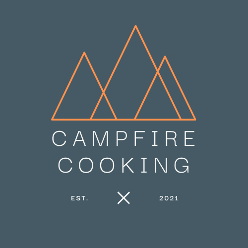

# **Campfire Cooking Website** 


[View Campfire cooking website](https://andrewboyd79-campfire-cooking.herokuapp.com/recipes)

[View GitHub repository for campfire-cooking](https://github.com/andrewboyd79/campfire-cooking)

This Campfire Cooking website has been produced by Andrew Boyd as a Milestone 3 Project for the Code Institute’s Full Stack Web Development course.

---

## About

After over a year of restrictions on travel and exploration, due to Covid-19, many people are seeking a chance to get back out in to the great outdoors for activity and recreation. 

For many, nights will be spent sitting, relaxing, swapping stories round a campfire with some food and drinks. Others will be happy to stay at home and enjoy time with family, friends and neighbours sharing a bite to eat and drink around a firepit or open BBQ.

The Campfire Cooking website aims to enable those individuals to find and share recipes, from around the world, that can be used to create dishes/meals over an open fire.

Users will get a list of ingredients needed, along with a method to follow; the site aims to give users an indication of how long it will take to prepare and cook the dishes and suggest how difficult the recipe is. Search functionality aims to help them find recipes quickly.

As the website relies solely on user contributions it aims to make the process of adding, editing and removing recipes simple and intuitive; however the site also give the administrators functionality to maintain and develop the site over time.

---

## **Contents**
1. **[UX](#ux)**
    - [Business Goals](#Business-Goals)
    - [Target Audience](#Target-Audience)
    - [User Goals](#User-Goals)
    - [User Stories](#User-Stories)
    - [User Considerations](#User-considerations)
    - [Wireframe diagrams](#Wireframe-diagrams)
        - [Home Page](#Home-page)
        - [Places to go Page](#Places-to-go-page)


    - [Design Considerations](#Design-considerations)
        - [Colours](#Colours)
        - [Fonts](#Fonts)
        - [Icons](#Icons)
        - [Styling](#Styling)

2. **[Features](#Features)**
    - [Initial Release Features](#Initial-release-features)
        - [Global Features](#Global-features)
        - [Home Page Features](#Home-page-features)
        - [Places to go Page Features](#places-to-go-page-features)

    - [Features for future releases](#Features-for-future-releases)

3. **[Information Architecture](#Information-Architecture)**
    - [Database Choice](#Database-Choice)
    - [Entity Relationship Diagram](#Entity-relationship-diagram)  

4. **[Technologies Used](#Technologies-used)**
    - [Tools](#Tools)
    - [Languages](#Languages)
    - [Libraries](#Libraries)

5. **[Testing](#Testing)**

6. **[Deployment](#Deployment)**

7. **[Credits](#Credits)**
    - [Images](#Images)
    - [Content](#Content)
    - [Code](#Code)
    - [Acknowledgements](#Acknowledgements)
---

# **UX**
User Experience, and associated UX design, is concerned with how a user interacts with something; throughout this project, consideration has been given to each of the five planes of UX.

## Business Goals
The business expects this website to:
- Provide recipes suitable for campfire cooking
- Inspire and generate an interest in cooking on an open fire
- Increase brand awareness and widen its target audience
- Showcase the experiences Campfire Cooking offers
- Connect fans with the Canpfire Cooking social media channels

## Target audience
The target audience of this website is:
- Individuals who regularly enjoy the outdoors/wilderness
- Campers / glampers
- Families looking for a new way to cook
    
Users will be expecting information presentation to be:
- Clear – the recipes need to be well laid out and easy to follow
- Engaging – the website should take users on a journey of discovery into new way of cooking and new flavours
- Intuitive - additing/editing recipes needs to simple process
- Appealing

Users will be comfortable with the following types of content:
- Imagery – of food, how it was cooked and products used to cook it
- Text – should be informative and concise 
- Videos
- Interactive elements

## User Goals
Users of this website expect to be able to:
- Be inspired by the recipes provided by Campfire Cooking
- Find recipes, metting their individual needs/tastes, that can be cooked on a campfire
- Add and edit their own recipes to the Campfire Cooking site
- Rely on Campfire Cooking recipes to create simple/tasty food
- Find out tips/techniques on how to cook on a campfire from other users/outdoor experts


## User Stories
The following user stories have been developed to outline some of the benefits the website has to its users:

1. As a user I want to find campfire recipes so that I can cook meals on an open fire

2. As a user I want to be able to add my own recipes so that others can enjoy them

3. As a user I want to be able to edit my recipes so that I can update/amend details after I've submitted them

4. As a user I want to be able to delete my recipes so that I'm in control of my recipe

5. As a user I want to find out best practices for campfire cooking so that I can improve my cookery

6. As a user I want to be able to search for recipes so I can quickly find the information I'm looking for

7. As a business owner I want to be able to generate increased brand awareness so that my brand becomes synonymous with open fire cooking

8. As a site administrator I want to be able to maintain the user recipe section so I can maintain the quality of the recipes submitted


## User considerations
Consideration has been given to the following when developing a website which meets the needs of both the business and the users:

- There are many different websites which provide recipes/cooking resources for all types of cooking; a number of other websites cover wild camping, however very few provide recipes for campfire cooking
- There are other successful examples of good recipe/cooking websites driving individuals towards a specific product (even in a crowded marketplace) e.g. Weber BBQs have very successful website & cookbooks which support their BBQ products ranges 

## Wireframe diagrams

### Recipes Pages

 - [Mobile view](Documentation/wireframes/Mobile-RecipesPages.png)
 - [Tablet view](Documentation/wireframes/Tablet-RecipesPages.png)
 - [Desktop view](Documentation/wireframes/Desktop-RecipePages.png) 

### Login Pages

 - [Mobile view](Documentation/wireframes/Mobile-LoginPages.png)
 - [Tablet view](Documentation/wireframes/Tablet-LoginPages.png)
 - [Desktop view](Documentation/wireframes/Desktop-LoginPages.png)

## Design Considerations

Imagery, colours, fonts and logo which are associated with the Campfire Cooking brand will be used throughout the site.

### Colours
 

These have been selected to give a clean minimal look to the website and to tie in with the material design colour palette, as provided by Materialize.  
 - blue-grey (#607d8b)
 - blue grey darken-2 (#455a64)
 - blue-grey lighten-4 (#CFD8DC)
 - orange (#ff9800)
 - white (#ffffff)
 - grey darken-4 (#212121)
 - grey darken-1 (#757575)
 - grey lighten-1 (#BDBDBD)

The combination has been checked on Adobe Colour; no potential conflicts have been found and the swatches are colour blind safe.

### Fonts

- The versatile sans-serif font family Red Hat Display has been chosen for use throughout the website at font weights 400, 500 & 700. It performs well at display sizes and weights but also is clear and readable at lower text sizes. It is available on Adobe fonts and if it fails it will be replaced with a sans serif font within the browser.

### Icons
The following icons will be used throughout this website:

- [account_circles](https://materializecss.com/icons.html)
- [add_circle](https://materializecss.com/icons.html)
- [assignment](https://materializecss.com/icons.html)
- [book](https://materializecss.com/icons.html)
- [cancel](https://materializecss.com/icons.html)
- [close](https://materializecss.com/icons.html)
- [create](https://materializecss.com/icons.html)
- [facebook](https://fontawesome.com/v5.15/icons/facebook-f?style=brands)
- [instagram](https://fontawesome.com/v5.15/icons/instagram?style=brands)
- [twitter](https://fontawesome.com/v5.15/icons/twitter?style=brands)
- [face](https://materializecss.com/icons.html)
- [filter_hdr](https://materializecss.com/icons.html)
- [input](https://materializecss.com/icons.html)
- [menu](https://materializecss.com/icons.html) 

Where possible, icons will use the "filled" theme for consistency. Material Design icons were used predominantly for consistency of appearance/design; however it was necessary to use Font Awesome icons for the social media links (as no Material Design icon exists). 

The following post/code by Terry Moore was used to create the social media icons [Materialize social](https://www.notion.so/Media-Log-9c78c2f4be534ed49f124fd9ceccb35e#f483ba95c80948e48022249924daaf13)

### Styling
The website was styled to give a minimalistic feel in keeping with the minimal nature of campfire cooking

---

# **Features**
The website will initially be developed as a Minimal Viable Product (MVP) and developed from there with new features being added as time/developer skills allow.

## Initial release features
Based on importance/feasability analysis the following features will be available in the initial release:

- Homepage which offers a selection of recipes cards for use campfire cooking from users of the site; ability to get information on the recipe name, prep/cook time, difficulty and serving numbers at a glance
- Search functionality which allows users to search for terms in recipe name, description, ingredients and method steps
- Ability for users to register for access, and subsequently login, to the site to add, edit and delete their own campfire cooking recipes to share with others in the campfire cooking community
- Ability for users to view their "profile" which initially displays recipes they've created, but in subsequent releases will allow for storage of favourite recipes (see features for future releases section)

## Global Features
The following features will persist across all website pages to provide a consistent look and feel:
 
 - Header section
    - Logo - the logo (.png file) will be located in the center of the header; it will provide consistent branding.  Clicking on the logo returns the user to the home page.
    - Navbar - the user registration/login elements will be located to the left hand side of the navbar and will only be displayed if no user has logged in to the website. Once the user has logged in the user name and logout element will sit on the right hand side of the logo with the other navigation elements (Recipe/Add recipe/My reipe) sitting to the left hand side.
    - Side navigation bar - on smaller screen sizes a side navigation bar will be present under a hamburger menu button and will contain the same navigation link options as the top navbar on larger screen sizes.
    - The header will size responsively.

- Footer Section
    - The footer will include social media links.
    - The footer elements will resize responsively.

## Home Page Features
 - The home page has a hero section displaying images of recipes, and in later releases, current selected collections i.e. summertime favourites
 - The search functionality allows users to search for specific words or phrases within a recipe name, description, ingredients or method steps. The returned recipes are displayed as cards
 - The main content block sits directly beneath the search function and displays recipes in a grid of recipe cards. The grid is 6x cards wide on largest displays and reduces to 4x cards, 2x cards and single card wide on smaller displays. Clicking each of the recipe cards takes the user to a new page with full recipe details.
 - If the user has added recipes to the site they have the chance to edit/delete the recipe directly from the homepage. Clicking the edit recipe icon takes the user to a new page which shows each recipe item and allows the user to add/delete or amend content as necessary. Clicking the delete button allows the user to delete the entire recipe from the site (following confirmation of their decision to delete)
 - If the admin account is being used the user will have access to edit/delete all recipes to ensure the site is maintained and managed

## View Recipe Page Features
- The view recipe page shows all the details related to an individual recipe on a larger card layout
- Recipe name, description and an image is displayed before a details grid gives information on the prep/cook time, difficulty and numbers served in similar format to recipes page - this is to give a consistent feel across the site. The elements size responsively changing from a 4x1 grid on larger displays to a 2x2 grid when screen size is limited
- The ingredients and method steps are listed side by side on larger displays and in blocks on smaller screen sizes

## Add Recipe Page Features
- The add recipe page contains a form which users complete to submit a recipe
- The fields have a variety of validation criteria applied to ensure that all the necessary data is provided
- To improve the user experience a number of fields are completed through selection from a dropdown menu - the options for which are supplied from other tables within the database (see Information Architecture section for details)
- Users are asked to submit an image url as opposed to a file upload due to limitations in storing such files within MongoDB
- A single ingredient and method step is initially provided with the user clicking to add additional steps - this ensures the only the required number of steps/ingredients are added to the database
- Buttons on the form allow the user to reset the form or submit the recipe. The user recieves a flashed message to indicate successful recipe submission

## Edit Recipe Page Features
- The edit recipe page consists of the same form as the add recipe page, but which each of the fields filled with the relevant data for the recipe being edited
- The user can change any of the fields, including adding/deleting ingredients/methos steps
- Buttons on the form allow the user to cancel editing the form or submit the changes

## Login Page Features
- The login page consists of a form to let the user enter their username and password and a link to the registration page

## Registration Page Features
- The registration page consists of a form to let the user sign up for campfire cooking.
- The fields contain various validation steps and the confirmed password value is hashed before being stored in the database
- Helper text is used with the fields, indicating if a value is suitable/unsuitable, to provide better user experience

## Features for future releases
The following features will be added to the website in future releases:

- Collections of recipes which bring together new recipes/seasonal recipes/recipes featuring a specific meat/ingredient
- Product pages and links to specific products named within recipes i.e. dutch oven would link to the dutch oven product page
- Separate fields within the ingredients section for numbers, units, ingredients e.g. 1 tbsp salt would be recorded as 3x seaparate values. This would allow for cleaner data entry and better user experience with more dropdowns etc.
- Use of categories (to be used in conjunction with collections) to allow the user to link to most relevant content/recipes
- Increased administrator functionality - ability for site administrator to add/delete values from categories/collections/menus
- Ability to upload images directly to sire instead of image URL'safe
- Incorporation of video recipes

---

# **Information Architecture**

## Database Choice
The NoSQL database Mongo DB has been chosen to host the data from campfire cooking. The following factors influenced this decision:

- Ease of use and development
- High performance
- High availablity
- Scalability

## Entity Relationship Diagram
The following Entity Relationship diagram has been produced to show the relationships between the entity sets in the campfireCooking database

[Entity Relationship Diagram](static/images/campfireCooking_entity_relationship_diagram.png)

# **Technologies Used**

## Tools
- GitPod is the IDE used in project Development
- Flask is the python microframework for rapid development
- PIP for package mananagement in Python to install and manage software packages
- Git for version control
- GitHub for storing and sharing project code repositories
- Heroku for Deployment
- Balsamiq for wireframe creation


## Languages
- This project uses HTML, CSS, JavaScript and Python programming languages 

## Frameworks/Libraries/Programs
- [Materialize (1.0.0)](https://materializecss.com/) was used to aid with responsive design and increation of some of the project elements
- [jQuery (3.5)](https://api.jquery.com/) was used to aid in the writing of the JavaScript elements
- [Adobe Fonts](https://fonts.adobe.com/) was used to provide the Brandon Grotesque font 
- [GitHub](https://github.com/andrewboyd79/campfire-Cooking) was used to hold the campfire cooking repository 
- [GitPod](https://gitpod.io/workspaces/) was used as the dev environment for the project
- [MongoDB](https://www.mongodb.com/cloud/atlas1) was used to host the database for the project
- [Heroku](https://www.heroku.com/) was used for deployment of the project

---

# **Testing**

A separate [testing.md](documentation/testing.md) file has been created to record the testing.

---

# **Deployment**

## Cloning the GitHub repository

It may be necessary to clone the repository from GitHub to your local computer.  Cloning the repository makes a copy of all the of repository data and takes it from GitHub to your local machine.  The following steps, detailed below, should be taken to clone a repository:

1. Navigate to the main page of the repository (in this case https://github.com/andrewboyd79/campfire-cooking)

2. Select the green button labelled Code

3. To clone the repo using HTTPS select the "HTTPS" option; to clone using an SSH key select the second opttion "SSH"; to clone using GitHub CLI select the third "GitHub CLI" option. Use the clipboard icon to copy the relevant information.

4. Open Git Bash and change the working directory to the location where you wish the cloned repo to be stored.

5. Use the git clone command and paste in the information copied in step 3 and Press Enter to create a local clone

6. If you wish to clone the repo to GitHub Desktop repeat steps 1 & 2 and from there select the "Open with GitHub Desktop" option

7. Follow the on screen prompts from within GitHub Desktop (this option required GitHub Desktop to be installed to be successful!)

Support information, for this process, can be found on the [GitHub Pages section](https://docs.github.com/en/free-pro-team@latest/github/working-with-github-pages/configuring-a-publishing-source-for-your-github-pages-site) of the GitHub Docs 

---

## Deployment to Heroku

To deploy the Campfire Cooking webiste to Heroku the following steps were taken:

1. Create a Procfile by using the command ````echo web: python app.py > Procfile```` at the terminal prompts. Any extra lines need to be removed from the end of the Procfile
2. Create a requirements.txt file using the command ````pip3 freeze —local > requirements.txt````
3. Log in to the Heroku account
4. Click the create new app button. Provide a name for the app (must be unique within Heroku) and choose the closest region to your location (namely Europe)
5. Set up deployment from GitHub repository ( Deploy > Deployment method > GitHub) - at this stage automatic deployment from GitHub repository should not be selected
6. Choose the appropriate GitHub repository (campfireCooking) from the options
7. Select the Reveal Config Vars option and set the config vars as follows:

| Key                           | Value                        |
|-------------------------------|------------------------------|
| Set Secret Key                | < secret key value >         |
| MONGO_DBNAME                  | "campfireCooking"            |
| MONGO_URI                     | "mongodb+srv://< user >:< password >@myfirstcluster.hg9mx.mongodb.net/campfireCooking?retryWrites=true&w=majority"
| IP                            | "0.0.0.0"                    |
| Port                          | "5000"                       |


# **Credits**

## Images
The following images have been used for this project:

- [Recipe Image](https://images.unsplash.com/photo-1601284702796-a27ffd3eff3c?ixid=MnwxMjA3fDB8MHxwaG90by1wYWdlfHx8fGVufDB8fHx8&ixlib=rb-1.2.1&auto=format&fit=crop&w=1266&q=80) - Image from Robert Krčmar

- [Recipe Image](https://images.unsplash.com/photo-1602065538249-7f958ef7b356?ixid=MnwxMjA3fDB8MHxwaG90by1wYWdlfHx8fGVufDB8fHx8&ixlib=rb-1.2.1&auto=format&fit=crop&w=1050&q=80) - Image from Gil Ndjouwou

- [Recipe Image](https://images.unsplash.com/photo-1576020956260-490f5c5fc892?ixid=MnwxMjA3fDB8MHxwaG90by1wYWdlfHx8fGVufDB8fHx8&ixlib=rb-1.2.1&auto=format&fit=crop&w=1234&q=80) - Image from Brooke Lark

- [Recipe Image](https://images.unsplash.com/photo-1566765969673-f9afb63c1fa1?ixid=MnwxMjA3fDB8MHxzZWFyY2h8OXx8Y2FtcGZpcmUlMjBjb29raW5nfGVufDB8fDB8fA%3D%3D&ixlib=rb-1.2.1&auto=format&fit=crop&w=400&q=60) - Image from Nick Artman

- [Recipe Image](https://images.unsplash.com/photo-1464867037750-e4ebec103b42?ixid=MnwxMjA3fDB8MHxwaG90by1wYWdlfHx8fGVufDB8fHx8&ixlib=rb-1.2.1&auto=format&fit=crop&w=1050&q=80) - Image from Alexey Ruban

- [Recipe Image](https://images.unsplash.com/photo-1614961909013-1e2212a2ca87?ixid=MnwxMjA3fDB8MHxwaG90by1wYWdlfHx8fGVufDB8fHx8&ixlib=rb-1.2.1&auto=format&fit=crop&w=1234&q=80) - Image from Micheile Henderson

- [Recipe Image](https://images.unsplash.com/photo-1596097558091-548313ceb129?ixid=MnwxMjA3fDB8MHxwaG90by1wYWdlfHx8fGVufDB8fHx8&ixlib=rb-1.2.1&auto=format&fit=crop&w=1050&q=80) - Image from Louis Hansel

- [Recipe Image](https://images.unsplash.com/photo-1464879972554-2a22f0ef1c1f?ixid=MnwxMjA3fDB8MHxwaG90by1wYWdlfHx8fGVufDB8fHx8&ixlib=rb-1.2.1&auto=format&fit=crop&w=1300&q=80) - Image from Autumn Mott Rodehaver

- [Recipe Image](https://images.unsplash.com/photo-1608474280544-81b631576c57?ixid=MnwxMjA3fDB8MHxwaG90by1wYWdlfHx8fGVufDB8fHx8&ixlib=rb-1.2.1&auto=format&fit=crop&w=1214&q=80) - Image from Alejandro Vasquez

- [Recipe Image](https://images.unsplash.com/photo-1536793896870-7f12343537c8?ixid=MnwxMjA3fDB8MHxwaG90by1wYWdlfHx8fGVufDB8fHx8&ixlib=rb-1.2.1&auto=format&fit=crop&w=1050&q=80) - Image from Justin Leniger

- [Recipe Image](https://images.unsplash.com/photo-1550789813-472d2a9cd237?ixid=MnwxMjA3fDB8MHxwaG90by1wYWdlfHx8fGVufDB8fHx8&ixlib=rb-1.2.1&auto=format&fit=crop&w=1301&q=80) - Image from Ken Ohyama

- [Hero Image](https://images.unsplash.com/photo-1466220549276-aef9ce186540?ixid=MnwxMjA3fDB8MHxwaG90by1wYWdlfHx8fGVufDB8fHx8&ixlib=rb-1.2.1&auto=format&fit=crop&w=1050&q=80) - Image from Myles Tan

- [View Recipes Image](https://images.unsplash.com/photo-1475483768296-6163e08872a1?ixid=MnwxMjA3fDB8MHxwaG90by1wYWdlfHx8fGVufDB8fHx8&ixlib=rb-1.2.1&auto=format&fit=crop&w=1350&q=80) - Image from Mike Erskinie


## Content
Example recipes have been taken from the following websites:

 - [Taste of Home](https://www.tasteofhome.com/collection/favorite-camping-recipes/#:~:text=40%20Easy%20Camping%20Recipes%20Ready%20for%20the%20Campfire,Cheese%20Hash%20Brown%20Packets.%20...%20More%20items...%20)

 - [BBC Good Food](https://www.bbcgoodfood.com/recipes/collection/campfire-recipes)

 - [Recipezazz](https://www.recipezazz.com/recipe/foil-wrapped-corn-on-cob-in-oven-bbq-or-open-fire-9603)

 - [Sorted Food](https://sortedfood.com/recipe/alemussels)


## Code
Code from the following sources has been taken and amended for use in this website:
- [Setting patterns on registration page](https://www.w3schools.com/TAGS/att_input_pattern.asp) - taken from w3schools

- [Materialize Social Media Icons](https://terrymooreii.github.io/materialize-social/) - taken from Terri Moore

- [Prevent form submission on enter key](https://stackoverflow.com/questions/895171/prevent-users-from-submitting-a-form-by-hitting-enter) - taken from stackoverflow


## Acknowledgements
- Thanks to my mentor (Aaron Sinnott) for his guidance and help during this project
- Thanks to the Code Instutute Slack community who helped with various articles, suggestions and problem solves